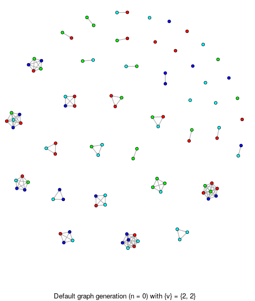
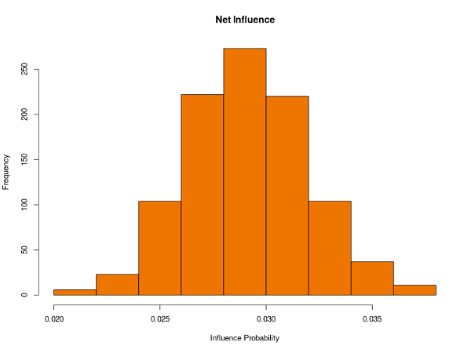
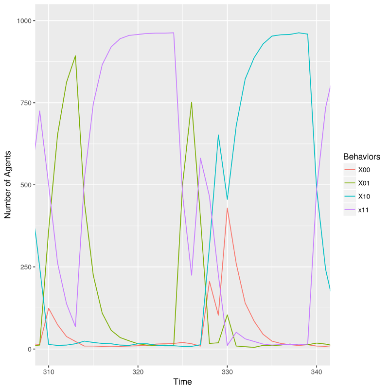

Iris 
====

This project aims to explore oppression, representation, and power dynamics as 
the collective output of interpersonal interactions arising from transmission
 of and response to normative behavior mediated by social networks through 
 agent based simulation.


Background
----------
This project is the programmatic implementation of my (UNM Math 499) 
independent study research paper.  It is inspired by the work of Iris Marion 
Young; specifically, her essay the "Five Faces of Oppression" (1990).  One of 
her primary ideas is that oppression need not necessarily be conceptualized as 
adversarial; that the ordinary workings of a liberal society could, in their 
own way, still produce a social structure that constrains some and 
disadvantages others along group lines (Young, 2009).

To investigate this, this project constructs a virtual society of agents, all
of whom have normative values, behaviors, and social bonds to others 
through both friendship and family.  Every time step, each agent interacts 
with a select sample of other agents from outside her social network and, 
through conceptualized interpersonal interactions, gains either acceptance or 
rejection of the values and behaviors that she currently possesses.  Instead of 
immediately acting upon this feedback, however, she then meets with a 
select group of people from inside her social circle as a form of 
comparison.  The outcome of these two interactions determines whether or not 
she will keep or change her behavior for the current round.  Some 
agents (due to simulation parameters) have more effective influence than 
others; it is part of the goal of this project to investigate how their 
composition might affect the resulting network structures.

That is the basic idea; a full explanation would be offensively long.  Readers 
interested in simulating similar work might consider Hellbing (1998) for an 
examination of modeling populations as probabilistic constructs or Schelling 
(1971) for his well-known application of game theory.

Building and Running
--------------------
To build this project execute the following:
```shell
$ make
```
and to include debugging symbols:
```shell
$ make debug
```
and to run the included tests:
```shell
$ make tests
```
To run see the `Usage` section below.

Usage
-----
This project operates on directories of experiments in order to facilitate 
batching.  A valid experiment is a single directory that contains the 
following three files:

 - *census.csv* - A CSV (comma separated values) file that contains 
 demographic information about the statistical household size for an 
 arbitrary population.
 - *params.cfg* - A simple configuration file that contains all of the 
 simulation parameters.  See the provided sample cases for what this file 
 should look like.
 - *values.csv* - Another CSV file that contains the mathematical definitions
  of all possible behaviors and values (attribute sample space).

With the above in place, to run this project execute the following:
```shell
$ iris --directory [experiment directory] --run [number of runs]
```
which will scan the specified directory for the required files, load them, 
and run a single simulation for each run requested.  All data is output to a 
sub-directory with the current timestamp and hash (to avoid time resolution 
problems with small simulations).

Output
------
This project outputs the following six (massive) files:

 - *comm.csv* - The final communication graph; this keeps track of every 
 interaction an agent has with another and what the outcome was.
 - *original-attributes.csv* and *final-attributes.csv* - The starting and 
 final behvaiors and values for each agent.  This project guarantees that 
 each simulation starts with an equal distribution of each value and behavior
  combination across the entire population; this makes it easy to see how it 
  changes over time.  In iGraph these are used as vertex attributes.
 - *original-network.csv* The structure of the randomly generated network 
 graph.  This includes the familial ties between agents and however many 
 others that are also linked via friendship.  In iGraph this is used to 
 supply information about edges between vertices.
 - *power.csv* - The conversion of the communication graph to a numeric 
 quantity that this project conceptualizes as the amount of "power" one agent
  has over another, dictated by how many influential actions they have taken 
  divided by the number of times they have interacted.  Since this uses the 
  communication graph (that is also serialized), this was mostly done so I 
  didn't need to write an additional R script.
 - *statistics.csv* - Keeps track of the overall population change over time,
  as given by the change in social group membership (delineated by behavior 
  combinations).

Sample Visualization
--------
*Note: All visuals were made in R with iGraph and ggplot2.*

#### Household Test
A small population of agents with immediate household networks 
only using U.S. Census data from 2015:



where each agent has randomly assigned values and starting behaviors, color 
coded 
as seen above.

The experiment to generate the data for this figure may be 
found under `household` inside the `sample_cases` directory.

#### Full Simulation
The primary output of this project is a concept of *net influence*, a 
quantity that measures the amount of influence an agent has at any point in 
time compared to everyone else in her society.  Because this project 
conceptualizes power as directional, net influence can be considered a 
measure of the flux of power through a single vertex in a network that 
includes all agents in a population regardless of connectedness.  A 
visualization of net influence for a single experiment of 100 agents, in 
which 5% of them are powerful and all have 4 distinct social groups to which 
they can belong, is shown in the histogram below:
 
   

An example of the cyclic shifts the model produces are also shown below:



and as stated are a product of representation; specifically, the 
representation of the powerful agents.  The more powerful agents are 
added, the more severe the cycles become until a threshold is reached.  This 
threshold indicates the number of powerful agents necessary to ensure that 
at least one powerful agent has a unique representation at all times, 
essentially providing a source of representational competition that works to 
moderate the potential swings in group membership.  This would seem to be an 
interesting argument for the merits of diversity in a representational 
democracy.

The experiment to generate the data for this figure may be 
found under `power_test` inside the `sample_cases` directory.  A comparison 
without powerful agents may be found under `no_power_test` inside the same 
directory.

Caveats
-------
Unfortunately, I ran out of time before this project could be all that I 
wanted and so there are some glaring issues worth noting.  In particular, 
this project is poorly optimized with no parallelism and a massive output 
footprint.  The lack of threading means that this project scales poorly; in 
particular, after ~10,000 agents signficant slowdown occurs.  The massive 
output footprint means that this project generates a lot of data - as in 
excessive amounts - and so care should be taken if attempting to run this 
project in batch mode at high agent counts.  Finally, this model is cyclic 
with low sensitivity; using custom initial graphs (e.g. leadership modeling) is 
likely pointless.

The usual caveats with toy academic models also apply.

Dependencies
------------
This project was written in C++11 and uses [CMake](https://cmake.org/) as its
 build system.  The excellent library [Catch](https://github.com/philsquared/Catch)
 is required for unit testing.

Please note that all dependencies have been configured as external projects 
and will be downloaded and built automatically.

License
-------
This project is released under the [Apache
2.0](https://www.apache.org/licenses/LICENSE-2.0) license as specified in [License.txt](License.txt).

References
----------
1. Hellbing, D. (1998). A mathematical model for the behavior of individuals 
in a social field. *Journal of Mathematical Sociology*, *19*(3), 189-219.
2. Schelling, T.C. (1971). Dynamic models of segregation. *Journal of 
Mathematical Sociology*, *1*, 143-186.
3. Young, I.M. (2009). Five faces of oppression. In G.L. Henderson & M. 
Waterstone (Eds.), *Philosophical forum* (p270). Routledge.